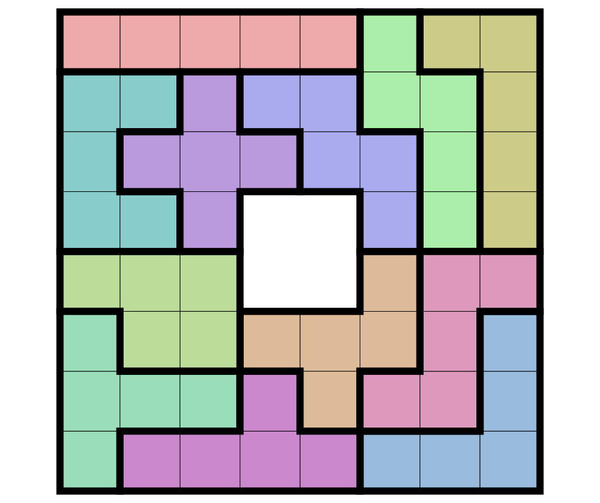
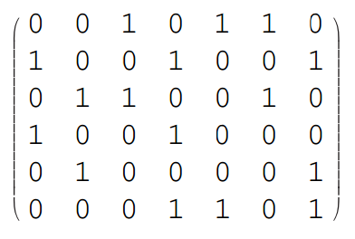

# Sub Problem 01: Exact Cover Problem & Knuth's DLX

텐동반점에서는 짜장면, 짬뽕, 우동, 볶음밥, 마파두부, 탕수육, 군만두의 7가지 메뉴를 판매하고 있다. 다만 주문을 받는 기준이 조금 이상한데, 아래의 6가지 세트메뉴의 구성으로만 주문을 받는다고 한다.

- 세트A: 우동 + 마파두부 + 탕수육
- 세트B: 짜장면 + 볶음밥 + 군만두
- 세트C: 짬뽕 + 우동 + 탕수육
- 세트D: 짜장면 + 볶음밥
- 세트E: 짬뽕 + 군만두
- 세트F: 볶음밥 + 마파두부 + 군만두

여기서 세트 조합을 몇 가지 주문하든 좋으나 각 세트는 한 번에 하나씩만 주문해야 하며(즉 세트B 3개, 혹은 세트D 4개 + 세트C 1개 등의 주문은 불가능), 위 세트메뉴의 조합으로 얻을 수 없는 메뉴 조합의 주문은 받지 않는다고 한다. 주문이 접수되는 조합과 그렇지 않은 조합의 예시를 들면 다음과 같다.

- 주문 가능한 조합
    - 짜장면 1 + 짬뽕 1 + 볶음밥 1 + 군만두 1 : 세트 D+E
    - 짬뽕 1 + 우동 2 + 마파두부 1 + 탕수육 2 : 세트 A+C
- 주문 불가능한 조합
    - 짜장면 단품
    - 짬뽕 1 + 마파두부 1
    - 우동 1 + 군만두 1

여기서 여러분은 텐동반점의 각 7가지 단일메뉴를 정확히 하나씩 전부 주문하고 싶다. 이것이 가능한지, 가능하다면 그 세트메뉴 조합은 무엇인지 보이는가?

---

위 문제는 전형적인 **exact cover problem**의 예시이다. 요컨대 어떤 (유한)집합 *X*와 그 부분집합들 중 일부를 모은 집합 *S* ⊆ P(*X*)에 대해, *S*에서 원소를 몇 개 선택하여 *X*의 각 원소가 그 안에 정확히 한 번씩 모두 들어가 있도록 할 수 있는가를 묻는 문제이다. 위 텐동반점 문제의 경우

- *X* = {짜장면, 짬뽕, 우동, 볶음밥, 마파두부, 탕수육, 군만두}
- *S* = {세트A, 세트B, 세트C, 세트D, 세트E, 세트F}

인 exact cover problem이며, 세트 A+D+E로써 7가지 메뉴를 한 번씩 모두 포함하는 조합을 얻으므로 곧 {A, D, E}가 유일한 정답인 셈이다. 조합론 및 계산복잡도 이론에서 중요하게 다루어지는 이 문제의 범주에는, 펜토미노 퍼즐, 스도쿠, 여덟 퀸 문제 등 수많은 종류의 조합 퍼즐들이 포함되어 있다.

이 exact cover problem을 해결하는 데에는 백트래킹(backtracking)이 효과적이다. 각 가능성을 최대한 깊게 탐색하면서 답이 나오지 않고 모순이 발생하면 다음 가능성의 탐색으로 넘어가는 알고리즘으로, 일종의 깊이 우선 탐색이기도 하다. Donald E. Knuth 교수는 자신의 논문 〈Dancing Links〉(2000)에서 이 exact cover problem을 해결하는 일반적인 비결정론적 재귀 알고리즘을 아래와 같이 제시하며 이를 **algorithm X**로 명명하였다. 아래는 원문 직접 인용.

> If *A* is empty, the problem is solved; terminate successfully.  
> Otherwise choose a column, *c* (deterministically).  
> Choose a row, *r*, such that *A*[*r*, *c*] = 1 (nondeterministically).  
> Include *r* in the partial solution.  
> For each *j* such that *A*[*r*, *j*] = 1,  
> &nbsp;&nbsp;&nbsp;&nbsp;&nbsp;&nbsp;&nbsp;&nbsp;
delete column *j* from matrix *A*;  
> &nbsp;&nbsp;&nbsp;&nbsp;&nbsp;&nbsp;&nbsp;&nbsp;
for each *i* such that *A*[*i*, *j*] = 1,  
> &nbsp;&nbsp;&nbsp;&nbsp;&nbsp;&nbsp;&nbsp;&nbsp;&nbsp;&nbsp;&nbsp;&nbsp;&nbsp;&nbsp;&nbsp;&nbsp;
delete row *i* from matrix *A*.  
> Repeat this algorithm recursively on the reduced matrix *A*.

여기서 *A*는 0과 1로 인코딩된 exact cover problem 문제를 의미하며, 위 텐동반점 예제의 경우 아래와 같을 것이다.

그리고 이 algorithm X를 2차원 doubly linked list 구조에 기초한 포인터 조작을 통해 구현한, 효율적인 백트래킹 알고리즘을 소개하였다. 저자는 여기서 각 node를 가리키는 포인터(링크)들이 마치 짝지어 춤추는 움직임을 보임에서 착안해 이 포인터 테크닉에 **dancing links**라는 이름을, algorithm X에 이를 적용한 알고리즘에 **DLX**라는 이름을 붙였다. 아래는 위 텐동반점 예제를 풀기 위한 2차원 doubly linked list로, 구체적으로 전체 알고리즘에 걸쳐 이를 어떻게 조작하는지에 대해서는 논문 본문 및 참고자료를 참고하라.

이 문제에서는 상기한 논문 〈Dancing Links〉에서 설명하는 DLX를 직접 구현하고, 이를 이용해 마음에 드는 조합 퍼즐 문제를 한 종류 풀어보자. 무슨 언어를 써서 구현하든 좋으며, 퍼즐의 종류 역시 exact cover problem의 범주에 포함된 것이라면 무엇이든 좋다.

---

## 참고자료

Exact cover에 대한 소개
- https://en.wikipedia.org/wiki/Exact_cover

arXiv에 게재된 〈Dancing Links〉 논문
- https://arxiv.org/abs/cs/0011047

DLX 알고리즘에 관한 보조 읽기 자료
- https://scriptinghelpers.org/blog/dancing-links

---

## 기타 이미지 출처

- https://en.wikipedia.org/wiki/Exact_cover#/media/File:Pentomino_Puzzle_Solution_8x8_Minus_Center.svg
- https://en.wikipedia.org/wiki/Sudoku#/media/File:Sudoku_Puzzle_by_L2G-20050714_standardized_layout.svg
- http://yue-guo.com/wp-content/uploads/2019/02/N_queen.png
- https://www.geeksforgeeks.org/exact-cover-problem-algorithm-x-set-2-implementation-dlx/